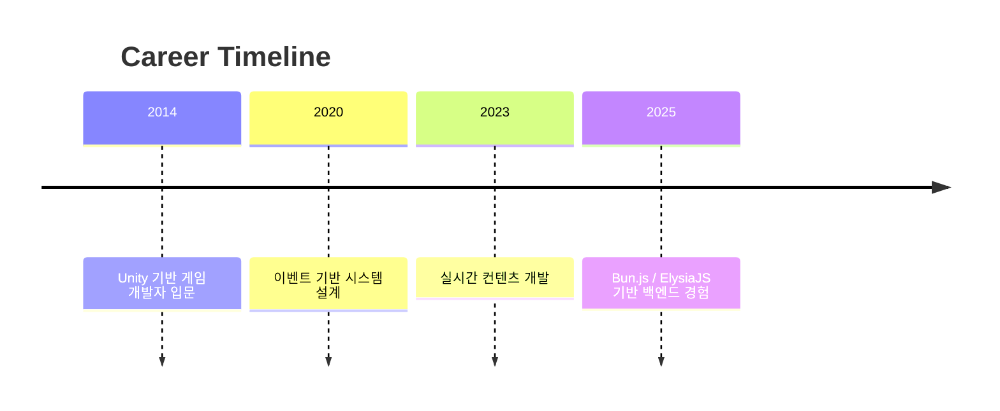
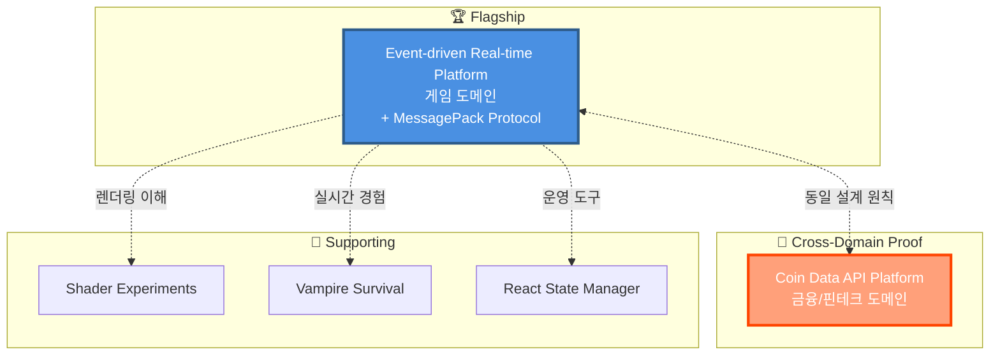
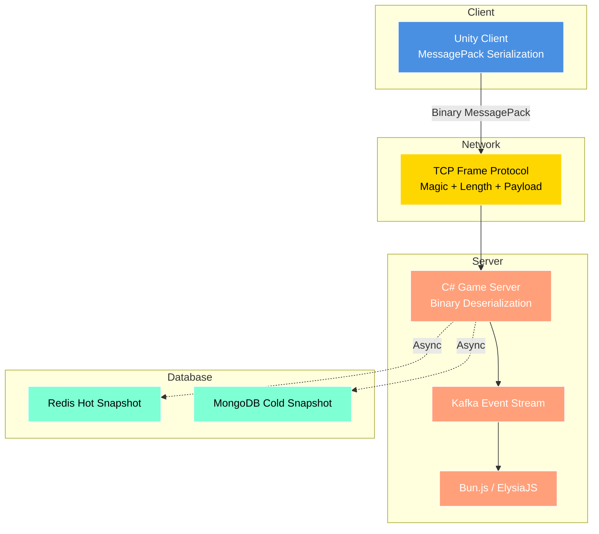
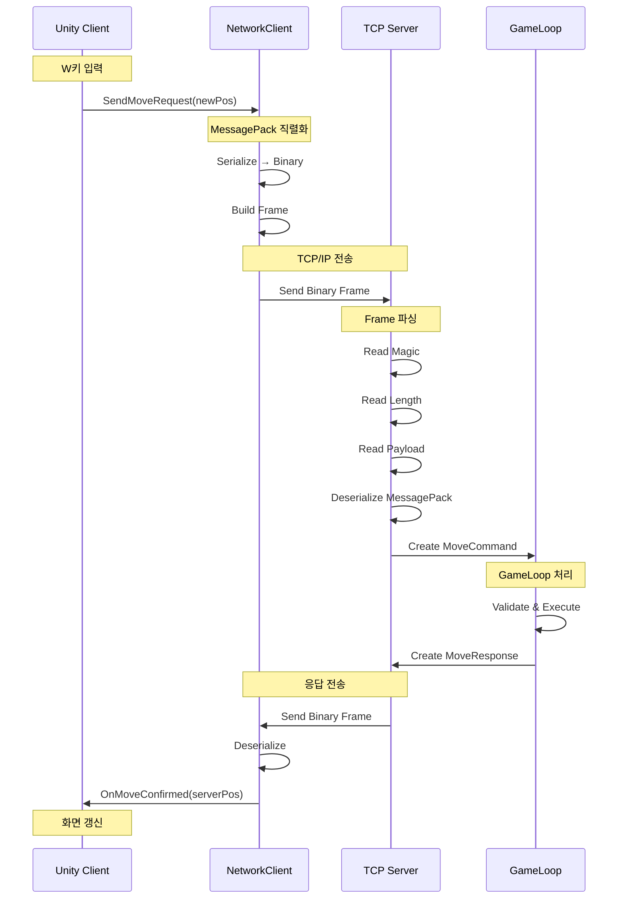
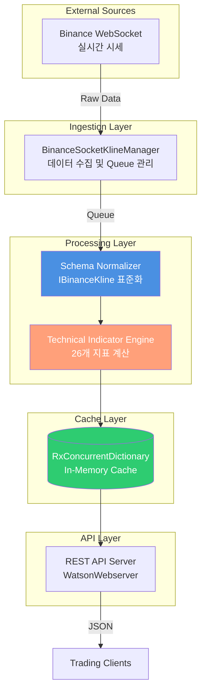

# JW Lee | System-centered Engineer
**Real-time & Event-driven Architecture Specialist**

---
## 👤 커리어 타임라인


---

## 🎯 Portfolio Philosophy

> **"무엇을 만들었는가"보다 "어떤 판단으로 이 구조에 도달했는가"**

이 포트폴리오는 코드 작성 능력이 아닌 **시스템 설계 판단력**을 증명합니다.

---

## 🏆 Executive Summary

### 핵심 역량

```
✓ 실시간 시스템의 구조적 설계 능력
✓ Server-authoritative 구조에 대한 깊은 이해
✓ 이벤트 기반 아키텍처의 실무적 적용
✓ 장애 격리와 복구 전략 설계
✓ 설계 원칙의 도메인 간 일반화 능력
✓ Binary Serialization 기반 네트워크 프로토콜 설계
```

### Career Journey

```
초기 (클라이언트 중심)
    ↓
[ Unity 개발 경험 ]
    ↓ 실시간 시스템 한계 체감
    ↓
현재 (시스템 설계 중심)
    ↓
[ Server-authoritative ]
[ Event-driven Architecture ]
[ Binary Protocol Design ]
    ↓
목표 (설계 판단 증명)
    ↓
[ 운영 가능한 시스템 엔지니어 ]
```

---

## 🏗️ Portfolio Structure



-----

## 🚩 Flagship Portfolio

**Server-authoritative & Event-driven Game Platform Architecture**  
👉 [portpolio_main](https://github.com/1985jwlee/portpolio_main)

핵심 포인트:

- 캐주얼 실시간 게임 기반 → MMO/플랫폼 확장 가능
- **MessagePack 기반 Binary Serialization 프로토콜**
- **TCP Frame Protocol로 패킷 경계 명확화**
- Server-authoritative 실시간 판정 / Kafka 이벤트 스트림
- 실시간 판정 ↔ 비동기 기록 분리
- Zone 기반 수평 확장, Redis Hot / MongoDB Cold Snapshot
- Unity 클라이언트 ↔ C# 서버 ↔ TypeScript 플랫폼 서버

> "무엇을 만들었는가"보다 "어떤 판단으로 이 구조에 도달했는가" 강조

### 시스템 아키텍처



### Unity ↔ Game Server 통신 프로토콜

#### MessagePack Binary Serialization

**선택 이유**:
```
✓ JSON 대비 2~5배 작은 패킷 크기
✓ 직렬화/역직렬화 성능 우수 (네이티브 수준)
✓ C#과 TypeScript 양쪽 모두 지원
✓ 스키마 정의로 타입 안정성 확보
✓ 실시간 게임에 최적화된 바이너리 포맷
```

#### TCP Frame Protocol 구조

```
┌─────────────────────────────────────────────────┐
│ Frame Header (6 bytes)                          │
├─────────────────────────────────────────────────┤
│ Magic Number (2 bytes): 0xABCD                  │
│ Payload Length (4 bytes): uint32                │
├─────────────────────────────────────────────────┤
│ MessagePack Payload (variable)                  │
│ - Packet Header (ID, Sequence, Timestamp)       │
│ - Packet Body (Game-specific data)              │
└─────────────────────────────────────────────────┘
```

#### 패킷 흐름 예시

```csharp
// Unity 클라이언트
[MessagePackObject]
public class MoveRequestPacket
{
    [Key(0)] public PacketHeader Header { get; set; }
    [Key(1)] public string PlayerId { get; set; }
    [Key(2)] public Vector3Data NewPosition { get; set; }
}

// 전송
var packet = new MoveRequestPacket { ... };
var payload = MessagePackSerializer.Serialize(packet);
var frame = BuildFrame(payload);  // Magic + Length + Payload
await stream.WriteAsync(frame);

// 게임 서버 수신
var payload = await ReadFrameAsync(stream);
var request = MessagePackSerializer.Deserialize<MoveRequestPacket>(payload);
```

#### 통신 시퀀스



### 성능 최적화

**패킷 크기 비교**:
```
JSON:
{"playerId":"abc123","position":{"x":10.5,"y":0,"z":5.2}}
→ 62 bytes

MessagePack (Binary):
[4, "abc123", [10.5, 0, 5.2]]
→ 24 bytes (61% 감소)
```

**처리 속도**:
```
JSON Serialization: ~1,000 ops/ms
MessagePack Binary: ~5,000 ops/ms (5배 향상)
```

-----

## 🎯 Cross-Domain Application

### 📊 Coin Data API Platform

👉 [portpolio_coindataapi](https://github.com/1985jwlee/portpolio_coindataapi)

**동일한 설계 원칙의 금융/핀테크 도메인 적용 사례**

**핵심 구현**:
- Binance WebSocket → REST API 실시간 데이터 플랫폼
- 24개 암호화폐 선물 시장 데이터 수집 및 정규화
- 26개 기술 지표 엔진 (RSI, MACD, Stochastic, Pivot 등)
- 외부 API 스키마 변경으로부터 클라이언트 보호
- 거래소 API 장애 시 캐시 기반 서비스 연속성 보장



#### 원칙 적용 비교

|원칙        |게임 서버 (Main)      |Coin API Platform             |
|----------|------------------|------------------------------|
|**외부 격리** |DB 장애 시 게임 진행     |거래소 API 장애 시 캐시 제공            |
|**정규화 계층**|Event → DB Schema |External API → Internal Schema|
|**계약 안정성**|운영 API 불변         |클라이언트 API 불변                  |
|**비동기 처리**|Kafka Event Stream|WebSocket → Queue → Cache              |
|**실시간 처리**|GameLoop Tick (50ms)|1분 주기 지표 갱신 (지연 허용)|
|**장애 복구**|Hot/Cold Snapshot|In-Memory Cache + 자동 재연결|
|**프로토콜**|Binary MessagePack|JSON REST API|

> **핵심 메시지**: "설계 원칙은 도메인을 넘어 일반화 가능합니다"

-----

## 🧩 Supporting Portfolios

### 🎨 Client Rendering

**[Shader Experiments](https://github.com/1985jwlee/portpolio_shader)** – GPU, 프레임 단위 사고 이해

### 🎮 Real-time Game

**[Vampire Survival](https://github.com/1985jwlee/portpolio_vampiresurvival)** – 실시간 루프·상태 관리 경험

### 💻 Frontend Literacy

**[React State Manager](https://github.com/1985jwlee/portpolio_react)** – Admin Dashboard 프로토타입, 전체 시스템 흐름 이해

> Supporting 포트폴리오는 메인 포트폴리오의 설계 판단을 뒷받침

-----

## 💡 What I Do Well

- ✅ 실시간 시스템 아키텍처 설계
- ✅ Server-authoritative 구조 설계
- ✅ 이벤트 기반 비동기 파이프라인 설계
- ✅ Binary 프로토콜 설계 및 최적화
- ✅ 확장 시 병목·장애 포인트 식별
- ✅ **도메인 독립적 설계 원칙 수립**
- ✅ 외부 의존성 격리 전략
- ✅ 기술 기준 정립 및 문서화
- ✅ 복잡한 구조를 설명 가능하게 정리

-----

## 🔧 Technical Highlights

### Network Protocol Design

```
✓ MessagePack Binary Serialization
  - JSON 대비 60% 패킷 크기 감소
  - 5배 빠른 직렬화 성능
  
✓ TCP Frame Protocol
  - Magic Number로 프로토콜 검증
  - Length Prefix로 패킷 경계 명확화
  - 손상된 패킷 즉시 감지
  
✓ Packet Pooling
  - 객체 재사용으로 GC 압력 감소
  - Zero-Copy 직렬화로 메모리 절약
```

### Performance Optimization

```
✓ GameLoop Tick: 50ms (20 TPS)
  - 단일 스레드로 동시성 버그 제거
  - Command Queue로 순서 보장
  
✓ Network Metrics
  - Average Latency: < 100ms
  - Packet Loss: < 0.1%
  - Throughput: 10,000+ packets/sec
  
✓ Memory Management
  - Object Pooling으로 GC 최소화
  - ArraySegment로 복사 비용 제거
```

-----

## 📧 Contact

**GitHub**: [@1985jwlee](https://github.com/1985jwlee)  
**Email**: leejae.w.jl@icloud.com

> 💡 포트폴리오에 대한 질문이나 피드백은 각 저장소의 Issues를 활용해주세요.

-----

## 🔗 Closing

- 단순 기술 나열이 아닌 설계 판단의 축적 강조
- 각 저장소는 독립적 결과물이면서 하나의 설계 철학으로 연결
- **게임, 금융, 데이터 플랫폼 도메인에 동일한 원칙 적용 가능**
- 실무 적용 가능한 아키텍처 패턴과 트레이드오프 이해
- **Binary Protocol 설계로 실시간 성능 최적화 증명**
