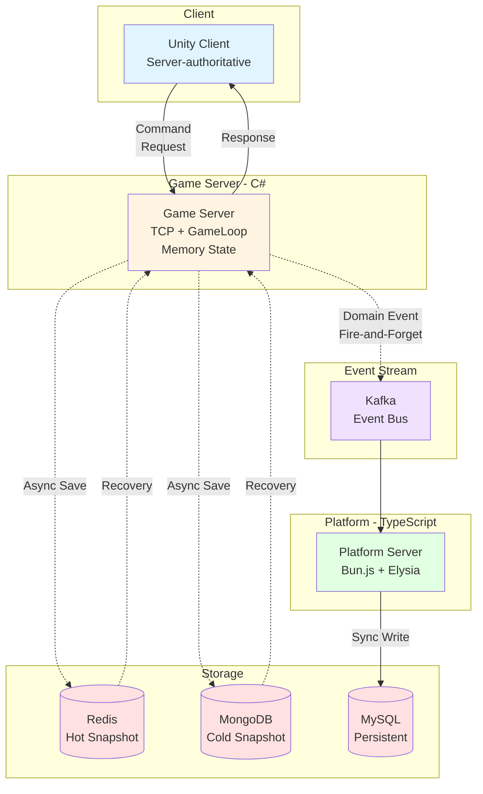

# JW Lee | System‑Centered Engineer  
**Real‑time & Event‑driven Architecture · Production‑Ready Systems**

---

## 📌 Executive Summary

- 실시간·이벤트 기반 시스템 중심 설계 엔지니어  
- Unity 클라이언트 → 서버 권한 구조 (Server‑authoritative) → 이벤트 기반 확장 시스템 경험  
- **프로덕션 레벨 IoT 백엔드 아키텍처 설계 및 구현 경험**  
- 다수 플랫폼, 백엔드, 실시간 시스템 설계 및 실행 역량

---

## 📈 Career Perspective

- 초기: 클라이언트 중심 개발 → 실시간 시스템 확장성 한계 체감  
- 현재: 서버 권한 구조 및 이벤트 기반 아키텍처 중심 설계  
- 목표: 설계 판단과 운영 가능성을 증명하는 시스템 엔지니어

---

## ⭐ Flagship Portfolio

### 1. Server‑authoritative & Event‑driven Game / Platform Architecture  
- **리포지토리:** `portpolio_main`  
- **핵심 포인트:**  
  - Unity 클라이언트 기반 실시간 플레이  
  - C# 게임 서버 및 Kafka 이벤트 스트림 아키텍처  
  - Redis Hot / MongoDB Cold Snapshot 기반 상태 복구

메인 아키텍처 도식:



---

## 🚀 Supporting Portfolios

이 섹션은 메인 아키텍처를 뒷받침하는 프로젝트들입니다. 각 저장소는 기술적 판단과 실전 설계 역량을 보여줍니다.

---

## 🏭 Production‑Level Backend Systems

### 📌 Smart Road Watering System — **Production‑Level IoT Backend Architecture**  
- **리포지토리:** `production‑iot‑backend`  
- **핵심 역할:** 프로덕션 환경에서 동작하는 IoT 백엔드 아키텍처 설계 및 구현  
- **핵심 목표:** PLC 기반 실시간 물 분사 제어, 자동 의사결정, 다중 사이트 동시 운영  

---

### 📋 프로젝트 개요

도시 표면 온도 상승 및 미세먼지 저감을 위한 **지능형 도로 살수 시스템**을 위한 백엔드입니다. 주요 요구사항:

- PLC 장비 기반 실시간 제어  
- 기상/환경 데이터 기반 자동화 판단  
- 다수 현장 (10+ 지역) 동시 운영  
- 실시간 모니터링 및 장애 알림  
- 높은 가용성 요구

이 프로젝트는 **IoT 환경의 실시간 통신/제어와 고가용성 백엔드 설계** 요구를 기반으로 구성되었습니다. ([github.com](https://github.com/1985jwlee/production-iot-backend))

---

## 🧠 시스템 아키텍처

### 📊 전체 시스템 구조

```text
Client (Web / Mobile)
   ↓ HTTPS / WSS
API Gateway (Nginx)
   ↓
Backend Services (Bun.js + Elysia)
   ↓
DB / Cache / Message Bus
   - MySQL
   - MongoDB
   - Redis
   - Kafka
   ↓
PLC Adapter (Modbus TCP)
   ↓
Field PLC Devices
```

이 계층형 구조는 **책임 분리, 확장성, 장애 격리**를 염두에 두고 설계되었습니다. ([github.com](https://github.com/1985jwlee/production-iot-backend))

---

## 🛠️ 핵심 설계 패턴

### 1) 모듈 기반 분할

- 인증/인가 서비스  
- 실시간 제어 서비스 (WebSocket)  
- PLC 통신 추상화 Adapter  
- 자동화 판단 서비스  
- Repository & DI 기반 구성 ([github.com](https://github.com/1985jwlee/production-iot-backend))

### 2) 이벤트 및 비동기 중심 처리

- 메시지 기반 Kafka 스트리밍  
- 비동기 처리로 **확장성 및 반응성 보강** ([github.com](https://github.com/1985jwlee/production-iot-backend))

---

## 🧪 기술 스택

| 계층 | 기술 |
|------|------|
| 서버 | Bun.js, ElysiaJS (TypeScript) |
| DB | MySQL, MongoDB |
| 캐시 | Redis |
| 메시징 | Kafka |
| 장비 통신 | Modbus TCP |
| 통신 | WebSocket, REST | ([github.com](https://github.com/1985jwlee/production-iot-backend))

---

## 📌 성능 및 운영 고려

- API 성능 최적화  
- 콜드 스타트 감소 및 응답성 향상  
- 메모리 최적화  
- 오류 격리 및 장애 대응 설계  
- 99.9% 이상 가용성 목표 ([github.com](https://github.com/1985jwlee/production-iot-backend))

---

## 🧩 Technical Decisions

1. **Bun.js + Elysia**  
   - 고성능 I/O 처리 및 빠른 응답  
2. **Kafka 기반 이벤트 스트림**  
   - 확장성과 안정성 확보  
3. **분리된 모듈 구조**  
   - 장애 격리 및 유지보수성 확보 ([github.com](https://github.com/1985jwlee/production-iot-backend))

---

## 🎮 Game & Real‑time Systems

- **Shader Experiments** — GPU, 프레임 기반 사고 강화  
- **Vampire Survival** — 실시간 루프/상태 관리 경험

---

## 📊 Data & Platform

- **Coin Data API** — 이벤트 기반 API 서비스  
- **React Experiments** — 프론트엔드 문법 이해 및 전체 시스템 흐름 경험

---

## 🚀 What I Do Well

### 아키텍처 설계

- 실시간 시스템 아키텍처  
- Server‑authoritative 구조  
- 이벤트 기반 비동기 파이프라인  
- 병목점 및 장애 포인트 식별

### Production‑Ready Design

- 고가용성 시스템 아키텍처 설계  
- 프로토콜 통합 (Modbus TCP, WebSocket, REST)  
- 동시성 제어 및 성능 최적화

### 엔지니어링

- 기술 기준 수립 및 문서화  
- 복잡 구조의 명확한 설명  
- 디자인 패턴의 실전적용

---

## 🏁 Closing Thoughts

단순 기능 나열이 아닌 **설계 판단과 운영 관점의 설계 역량**을 중심으로 각 저장소는 연결되어 있습니다.  
IoT 백엔드 및 실시간 시스템 아키텍처 경험을 통해 **복잡한 문제 해결 역량**을 입증합니다.

---

## 📎 Project Links

- Main Architecture: `portpolio_main`  
- IoT Backend: `production‑iot‑backend`  
- Other Supporting Repos: Shader Experiments, Vampire Survival, Coin Data API, React Experiments
