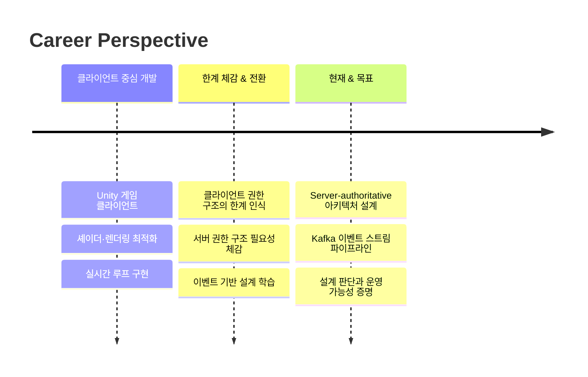
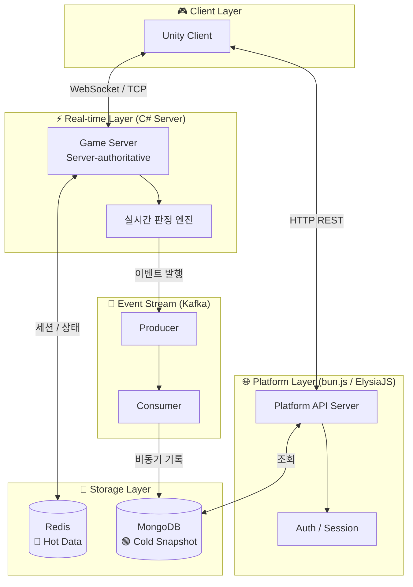
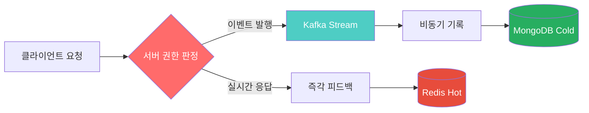
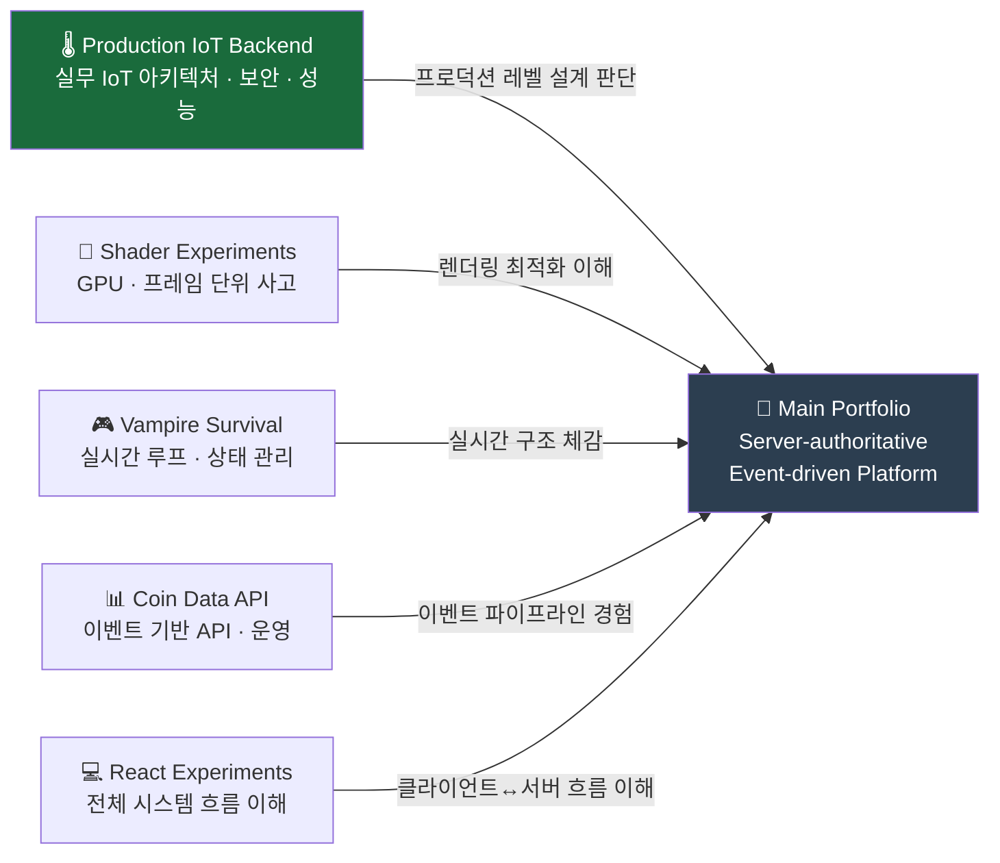
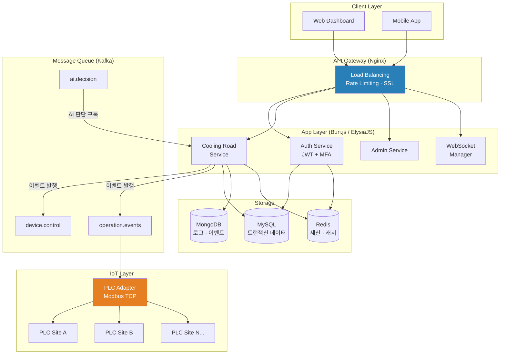
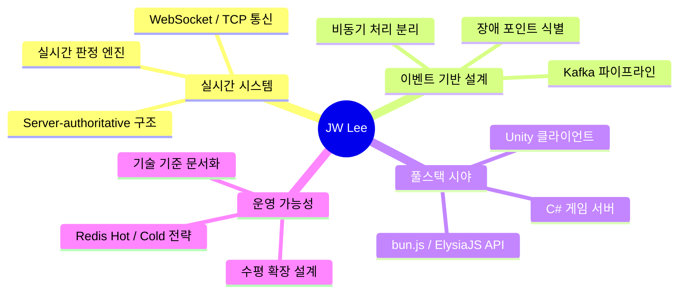

# JW Lee | System-centered Engineer

> **“무엇을 만들었는가”보다 “어떤 판단으로 이 구조에 도달했는가”**

**Real-time · Event-driven · Server-authoritative Architecture**

-----

## 🏆 Executive Summary

|키워드               |설명                                          |
|------------------|--------------------------------------------|
|🎮 **Game Server** |Unity 클라이언트 ↔ C# Server-authoritative 실시간 판정|
|⚡ **Event-driven**|Kafka 기반 이벤트 스트림 & 비동기 파이프라인                |
|🌐 **Platform API**|bun.js / ElysiaJS 기반 플랫폼 서버                 |
|📐 **Architecture**|확장성·장애 포인트 식별 중심의 설계 판단                     |

-----

## 🧭 Engineering Journey

-----

## 🚩 Flagship Portfolio

**→ [portpolio_main](https://github.com/1985jwlee/portpolio_main)**

**Server-authoritative & Event-driven Game / Platform Architecture**

### System Architecture

### 핵심 설계 판단

|설계 포인트                  |판단 근거                    |
|------------------------|-------------------------|
|Server-authoritative    |클라이언트 치트 방지, 일관된 게임 상태 보장|
|실시간 판정 ↔ 비동기 기록 분리      |판정 지연 최소화, 기록 부하 격리      |
|Redis Hot / MongoDB Cold|읽기 성능 vs 영속성 트레이드오프      |
|Zone 기반 수평 확장           |단일 서버 병목 제거, 점진적 확장 가능   |

-----

## 🧩 Supporting Portfolios

|포트폴리오                       |링크                                                                           |역할                          |
|----------------------------|-----------------------------------------------------------------------------|----------------------------|
|🌡️ **Production IoT Backend**|[production-iot-backend](https://github.com/1985jwlee/production-iot-backend)|실무 IoT 시스템 · 마이크로서비스 · 보안 설계|
|🎨 Client Rendering          |[Shader Experiments](https://github.com/1985jwlee/portpolio_shader)          |GPU, 프레임 단위 사고 이해           |
|🎮 Real-time Game            |[Vampire Survival](https://github.com/1985jwlee/portpolio_vampiresurvival)   |실시간 루프·상태 관리 경험             |
|📊 Data Pipeline             |[Coin Data API](https://github.com/1985jwlee/portpolio_coindataapi)          |이벤트 기반 API & 운영 경험          |
|💻 Frontend Literacy         |[React Experiments](https://github.com/1985jwlee/portpolio_react)            |전체 시스템 흐름 이해                |

### 🌡️ Production IoT Backend 상세

**도로 살수 시스템**을 위한 프로덕션 레벨 IoT 백엔드 아키텍처

**핵심 설계 패턴 요약:**

|패턴                  |적용                 |성과                        |
|--------------------|-------------------|--------------------------|
|Adapter Pattern     |PLC 통신 추상화         |환경 변수 하나로 Real/Fake PLC 전환|
|Repository Pattern  |DB 접근 계층 분리        |ORM 교체 시 레포지토리만 수정        |
|Dependency Injection|tsyringe 기반 DI     |Mock 주입으로 단위 테스트 가능       |
|Semaphore Pattern   |동시 이미지 캡처 제어       |CPU 사용률 70% → 30%         |
|Event-driven (Kafka)|서비스 간 비동기 통신       |장애 전파 차단, 비동기 처리          |
|Multi-level Cache   |Memory → Redis → DB|L1 캐시 히트 시 마이크로초 응답       |

> Supporting 포트폴리오는 독립 결과물이면서, 메인 포트폴리오의 **설계 판단을 뒷받침하는 근거**

-----

## 💡 Core Competencies

-----

## 🔗 Tech Stack

**🎮 Game Client**  

**⚙️ Game Server / Backend**  

**🌐 Platform API**  

**🌡️ IoT / Protocol**  

**📨 Event Stream & Messaging**  

**💾 Database & Cache**  

**💻 Frontend**  

**🔐 Security**  

**🛠️ Tools & Infra**  

-----

## 📬 Contact

각 저장소는 독립적 결과물이면서 **하나의 설계 철학으로 연결**됩니다.  
단순 기술 나열이 아닌, **설계 판단의 축적**을 확인하고 싶다면 메인 포트폴리오를 먼저 보세요.

**→ [portpolio_main](https://github.com/1985jwlee/portpolio_main)**