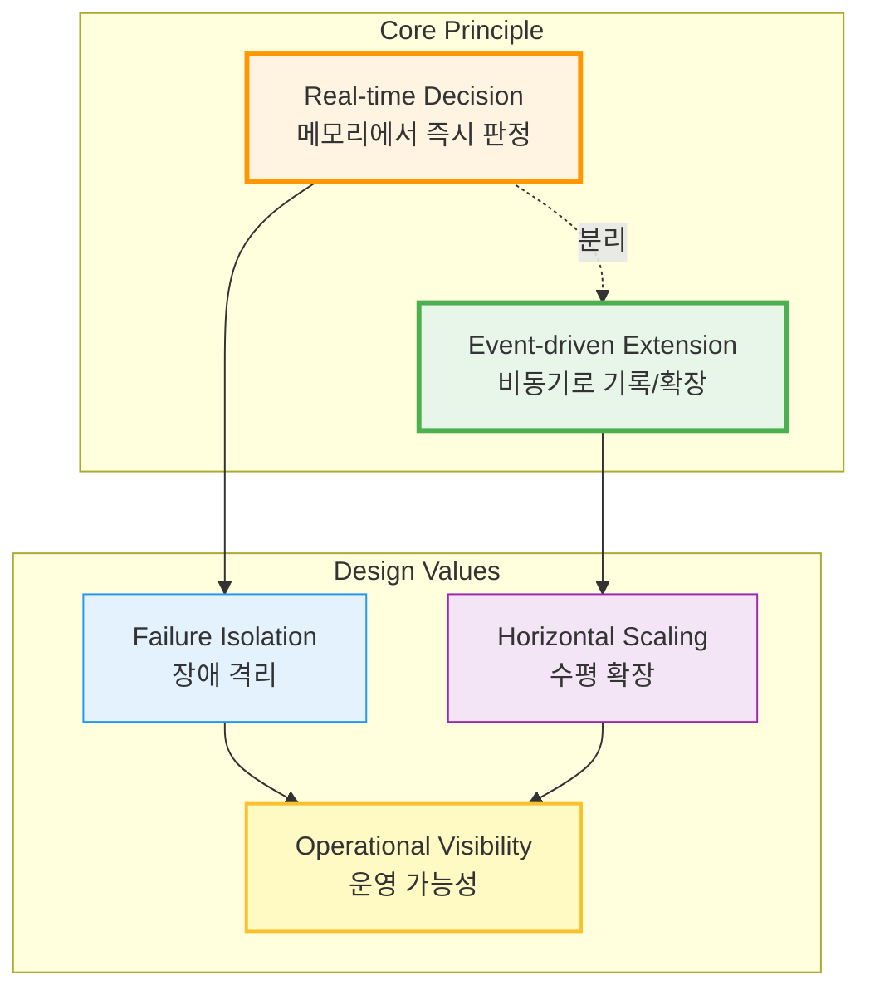
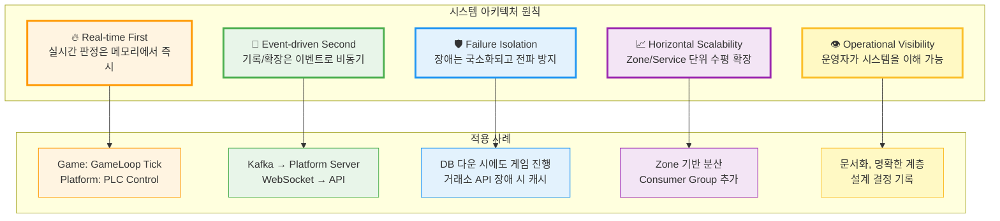
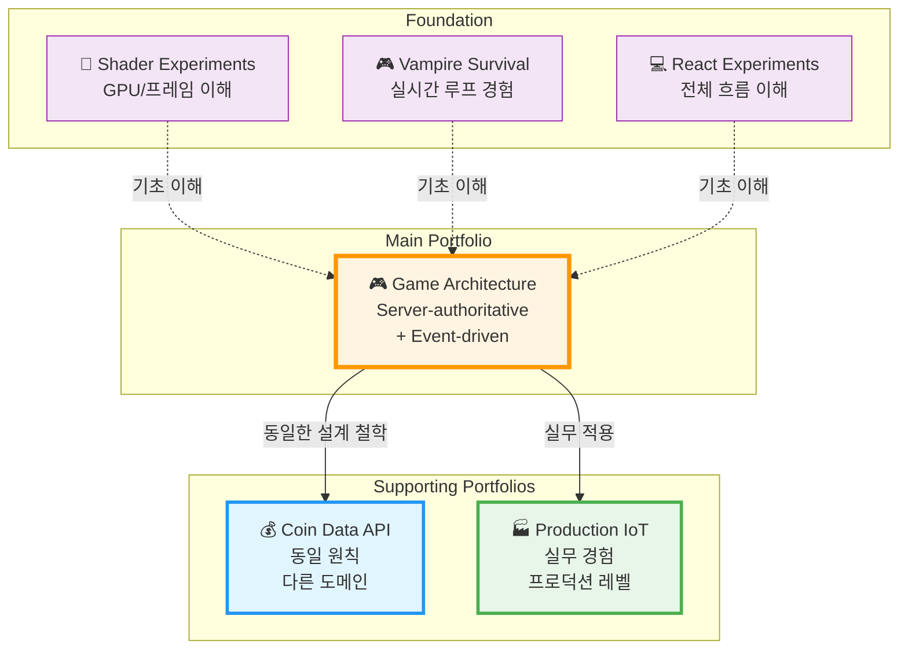
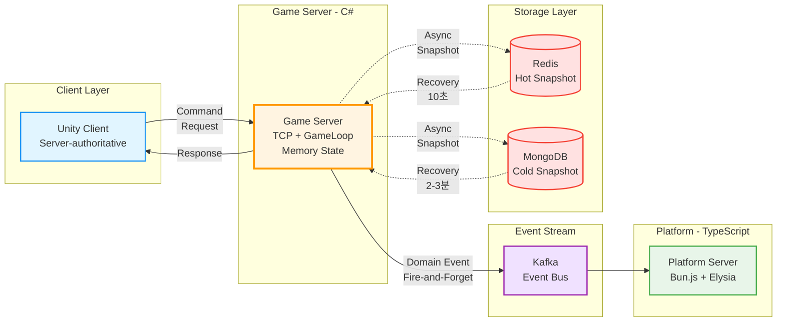
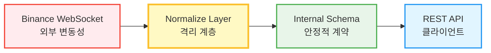
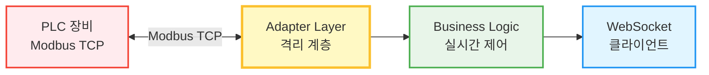
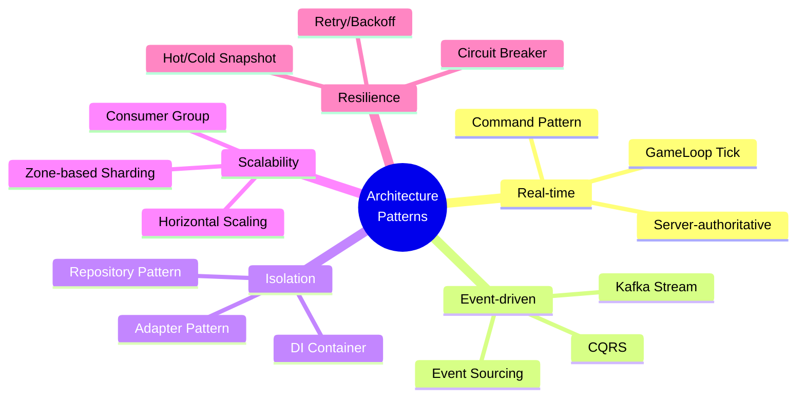
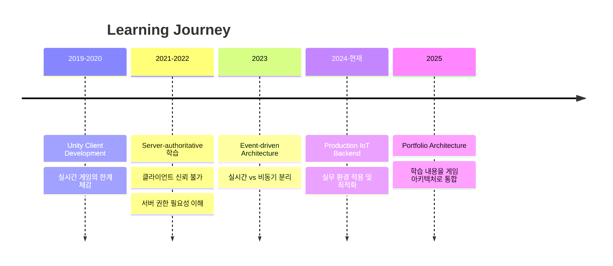

# JW Lee | System Architecture Engineer

> **"실시간 판정은 메모리에서 끝나고, 기록과 확장은 이벤트로 분리한다"**

<div align="center">

[](https://github.com/1985jwlee)
[](https://github.com/1985jwlee)
[](https://github.com/1985jwlee)

</div>

---

## 🎯 Who I Am

**시스템 중심 설계 엔지니어**로, 실시간 처리와 이벤트 기반 확장을 구조적으로 분리하는 아키텍처를 설계합니다.

```
초기: Unity 클라이언트 개발 → 실시간 시스템의 한계 체감
현재: Server-authoritative + Event-driven 아키텍처 설계
목표: 설계 판단과 운영 가능성을 증명하는 시스템 엔지니어
```

**핵심 가치:**
- ✅ "무엇을 만들었는가"보다 **"왜 이렇게 설계했는가"**
- ✅ 코드 작성 능력보다 **시스템 설계 판단력**
- ✅ 기능 구현보다 **운영 가능성과 확장성**

---

## 🏗️ Architecture Philosophy





---

## 💼 Portfolio Structure



---

## 🚀 Main Portfolio

### 🎮 Event-driven Game Platform Architecture

**핵심 아키텍처:** Unity Client → C# Game Server → Kafka → TypeScript Platform

[](https://github.com/1985jwlee/portpolio_main)



**증명하는 것:**
- ✅ Server-authoritative 구조로 치트 방지는 구조적 해결
- ✅ 실시간 판정(메모리) ↔ 비동기 기록(이벤트) 완전 분리
- ✅ DB/Kafka 장애 시에도 게임플레이 정상 동작
- ✅ Zone 기반 수평 확장 → 사용자 10배 증가 시 서버 10배 추가
- ✅ Hot Snapshot (10초 복구) / Cold Snapshot (2-3분 복구)

**기술 스택:**
- Game Server: C# + TCP/IP + MessagePack
- Platform Server: TypeScript + Bun.js + ElysiaJS + Drizzle ORM
- Event Stream: Apache Kafka
- Storage: Redis (Hot) + MongoDB (Cold) + MySQL (Persistent)

**설계 문서:**
- 📖 [Architecture Detail](https://github.com/1985jwlee/portpolio_main/blob/main/docs/architecture-detail.md) - 전체 시스템 구조 및 설계 원칙
- 🎯 [Design Decisions](https://github.com/1985jwlee/portpolio_main/blob/main/docs/design-decisions.md) - 왜 이렇게 설계했는가
- 🚀 [Implementation Roadmap](https://github.com/1985jwlee/portpolio_main/blob/main/docs/implementation-roadmap.md) - 단계별 구현 계획

---

## 🧩 Supporting Portfolios

### 💰 Coin Data API — Platform Server in Practice

**동일한 원칙의 비게임 도메인 적용**

[](https://github.com/1985jwlee/portpolio_coindataapi)



**메인 포트폴리오와의 연결:**

| 원칙 | Game Server | Coin API |
|------|-------------|----------|
| **외부 격리** | DB 장애 시 게임 진행 | 거래소 API 장애 시 캐시 제공 |
| **정규화 계층** | Event → DB Schema | External API → Internal Schema |
| **계약 안정성** | 클라이언트 API 불변 | 클라이언트 API 불변 |
| **비동기 처리** | Kafka Event Stream | WebSocket → Queue → REST |

**기술 스택:** C# + Binance.Net + TALib.NETCore + WatsonWebserver

---

### 🏭 Smart Road Watering System — Production Level IoT

**프로덕션 환경에서의 실무 경험**

[](https://github.com/1985jwlee/production-iot-backend)



**핵심 성과:**
- ⚡ 콜드 스타트 시간: 1.2초 → 0.4초 (70% 감소)
- ⚡ API 응답 시간: 평균 20% 향상
- ⚡ 메모리 사용: 약 30% 감소
- 🔧 CPU 사용률: 100% → 35% (Semaphore 패턴)
- 🔧 이미지 크기: 2.5MB → 800KB (WebP 변환)

**적용된 설계 패턴:**
- Adapter Pattern (PLC 통신 추상화)
- Repository Pattern (데이터 접근 추상화)
- Dependency Injection (느슨한 결합)
- Event-driven Architecture (Kafka)
- Semaphore Pattern (동시성 제어)

**실무에서 해결한 기술적 챌린지:**

<details>
<summary><b>1️⃣ WebSocket 연결 안정성</b> - 모바일 환경 네트워크 불안정 대응</summary>

**문제:** 네트워크 전환 시 연결 끊김, 좀비 연결, 재연결 폭풍

**해결:**
- Application-level Heartbeat (30s ping / 90s pong timeout)
- Exponential Backoff 재연결 (1s → 2s → 4s → ... → max 30s + jitter)

**결과:**
- 평균 연결 유지: 5분 → 2시간+
- 좀비 연결: 10-15% → <1%
- 재연결 성공률: 60% → 95%
</details>

<details>
<summary><b>2️⃣ 동시성 제어</b> - FFmpeg 이미지 처리 병목 해결</summary>

**문제:** 10개 사이트 동시 캡처 → CPU 100%, OOM 에러

**해결:**
- Semaphore Pattern (최대 3개만 동시 실행)
- 이미지 최적화 (4K→1920x1080, JPEG→WebP)
- 타임아웃 설정 (10초)

**결과:**
- CPU: 100% → 35%
- 메모리: 2GB (OOM) → 600MB
- 이미지 크기: 2.5MB → 800KB
</details>

<details>
<summary><b>3️⃣ PLC 통신 추상화</b> - 개발 환경 격리</summary>

**문제:** 실제 PLC 없이 개발 불가능, 제조사별 프로토콜 차이

**해결:**
- Adapter Pattern으로 IPLCReader/IPLCWriter 인터페이스 정의
- FakePLCAdapter로 시뮬레이션 (현실적인 랜덤 데이터)
- Factory Pattern으로 환경별 자동 선택

**결과:**
- PLC 없이 전체 시스템 개발 가능
- 테스트 환경 구축: 2일 → 10분
- 새 제조사 PLC 추가 시 새 어댑터만 구현
</details>

<details>
<summary><b>4️⃣ 실시간 데이터 동기화</b> - HTTP Polling → WebSocket + Kafka</summary>

**문제:** HTTP Polling의 비효율 (불필요한 요청, 5초 지연)

**해결:**
- WebSocket + Kafka 이벤트 스트림
- 선택적 브로드캐스트 (토픽 구독 방식)
- Kafka 오프셋 관리로 데이터 유실 방지

**결과:**
- 지연 시간: 0-5초 → <100ms
- CPU 사용률: 40% → 15%
- 네트워크: 10MB/min → 1MB/min
- 확장성: 100 → 10,000+ clients
</details>

**기술 스택:** Bun.js + TypeScript + ElysiaJS + Drizzle ORM + Kafka + WebSocket

**상세 문서:**
- 🏗️ [System Architecture](https://github.com/1985jwlee/production-iot-backend#-system-architecture)
- 🎨 [Design Patterns](https://github.com/1985jwlee/production-iot-backend#-core-design-patterns)
- 🔧 [Technical Challenges](https://github.com/1985jwlee/production-iot-backend/blob/main/TECHNICAL_CHALLENGES.md) ⭐ **실무 구현 경험 상세**

---

## 🎨 Foundation Portfolios

### 기초 이해를 위한 학습 프로젝트

| 프로젝트 | 목적 | 핵심 학습 |
|---------|------|----------|
| 🎨 [Shader Experiments](https://github.com/1985jwlee/portpolio_shader) | GPU 렌더링 파이프라인 | 프레임 단위 사고, 병렬 처리 이해 |
| 🎮 [Vampire Survival](https://github.com/1985jwlee/portpolio_vampiresurvival) | 실시간 게임 루프 | 상태 관리, 충돌 처리, 최적화 |
| 💻 [React Experiments](https://github.com/1985jwlee/portpolio_react) | 프론트엔드 이해 | 전체 시스템 흐름 파악, 클라이언트 관점 |

---

## 💡 What I Do Well

### 1. 시스템 아키텍처 설계

```
✓ 실시간 처리와 비동기 처리의 명확한 분리
✓ Server-authoritative 구조 설계
✓ Event-driven 확장 파이프라인 설계
✓ 확장 시 병목·장애 포인트 사전 식별
```

### 2. 프로덕션 레벨 설계

```
✓ 고가용성 시스템 아키텍처
✓ 다중 프로토콜 통신 (Modbus TCP, WebSocket, REST)
✓ 동시성 제어 및 성능 최적화
✓ 테스트 가능성, 확장성을 고려한 설계
```

### 3. 설계 판단력

```
✓ 대안 비교와 트레이드오프 분석
✓ 기술 선택의 근거 명문화
✓ 복잡한 구조를 이해 가능하게 정리
✓ 디자인 패턴의 실무적 적용
```

---

## 🛠️ Tech Stack

### Languages & Runtimes


### Backend Frameworks


### Message Queue & Real-time


### Databases


### Game Development


### ORM


---

## 📊 Architecture Patterns Used



---

## 🎓 Learning Path



---

## 📧 Contact

- **Email**: leejae.w.jl@icloud.com
- **GitHub**: [@1985jwlee](https://github.com/1985jwlee)
- **Location**: Seoul, South Korea

---

## 📝 Closing Statement

이 포트폴리오는 **"코드를 작성하는 능력"**이 아니라  
**"시스템을 설계하고 판단하는 능력"**을 증명합니다.

### 증명된 것:

✅ 실시간 시스템의 구조적 설계 능력  
✅ 장애를 격리하고 복구하는 전략  
✅ 확장 가능한 아키텍처 설계  
✅ 운영 가능성까지 고려한 시스템 설계  
✅ 조직에 남는 시스템을 만드는 사고방식  

### 검증 방법:

- 📖 설계 문서: 모든 판단의 근거 명시
- 🔧 운영 가이드: 장애 시나리오별 대응 방안
- 📈 확장 시나리오: 10배 성장 대응 전략
- 🚀 구현 로드맵: 실제 구현 가능성 증명

---

**Last Updated**: 2025-01-30

> "The best architecture is the one that can be explained to others."