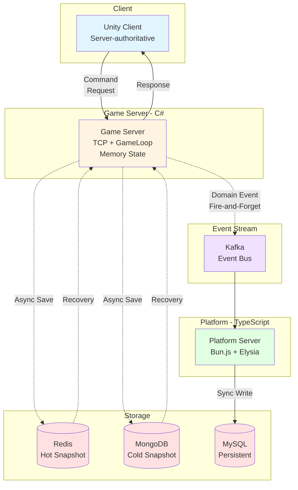

# JW Lee | System-centered Engineer

**Real-time & Event-driven Architecture**

-----

## 🏆 Executive Summary

- 실시간·이벤트 기반 시스템 중심 설계 엔지니어
- Unity 클라이언트 → 서버 권한 구조(Server-authoritative) → 이벤트 기반 확장 시스템 경험
- 프로덕션 레벨 IoT 백엔드 아키텍처 설계 및 구현 경험

-----

## 🎯 Career Perspective

- 초기: 클라이언트 중심 개발 → 실시간 시스템 한계 체감
- 현재: 서버 권한 구조 & 이벤트 기반 아키텍처 설계
- 목표: 설계 판단과 운영 가능성을 증명하는 시스템 엔지니어

-----

## 🚩 Flagship Portfolio

**Server-authoritative & Event-driven Game / Platform Architecture**  
👉 [portpolio_main](https://github.com/1985jwlee/portpolio_main)

### 시스템 아키텍처

핵심 포인트:

- 캐주얼 실시간 게임 기반 → MMO/플랫폼 확장 가능
- Server-authoritative 실시간 판정 / Kafka 이벤트 스트림
- 실시간 판정 ↔ 비동기 기록 분리
- Zone 기반 수평 확장, Redis Hot / MongoDB Cold Snapshot
- Unity 클라이언트 ↔ C# 서버 ↔ bun.js/Elysia 플랫폼 서버

> “무엇을 만들었는가”보다 “어떤 판단으로 이 구조에 도달했는가” 강조

-----

## 🧩 Supporting Portfolios

### 🏭 Production-level Projects

- 🌡️ **[Smart Road Watering System Backend](https://github.com/1985jwlee/production-iot-backend)** – 프로덕션 레벨 IoT 백엔드 아키텍처
  - **핵심**: PLC 장비 실시간 제어, 다중 사이트 관리, 고가용성 설계
  - **기술**: Bun.js, TypeScript, ElysiaJS, Drizzle ORM
  - **패턴**: Adapter Pattern (PLC 추상화), Repository Pattern, DI, Event-driven, Semaphore
  - **인프라**: MySQL + MongoDB + Redis, Kafka, WebSocket
  - **최적화**: 콜드 스타트 70% 감소, API 응답 20% 개선, 메모리 30% 절감

### 🎮 Game & Real-time Systems

- 🎨 **Client Rendering:** [Shader Experiments](https://github.com/1985jwlee/portpolio_shader) – GPU, 프레임 단위 사고 이해
- 🎮 **Real-time Game:** [Vampire Survival](https://github.com/1985jwlee/portpolio_vampiresurvival) – 실시간 루프·상태 관리 경험

### 📊 Data & Platform

- 📊 **Data Pipeline:** [Coin Data API](https://github.com/1985jwlee/portpolio_coindataapi) – 이벤트 기반 API & 운영 경험
- 💻 **Frontend Literacy:** [React Experiments](https://github.com/1985jwlee/portpolio_react) – 전체 시스템 흐름 이해용

> Supporting 포트폴리오는 메인 포트폴리오의 설계 판단을 뒷받침

-----

## 💡 What I Do Well

### 아키텍처 설계

- 실시간 시스템 아키텍처 설계
- Server-authoritative 구조 설계
- 이벤트 기반 비동기 파이프라인 설계
- 확장 시 병목·장애 포인트 식별

### 프로덕션 레벨 설계

- 고가용성 시스템 아키텍처 설계
- 다중 프로토콜 통신 구현 (Modbus TCP, WebSocket, REST)
- 동시성 제어 및 성능 최적화
- 실무 환경 고려한 설계 (테스트 가능성, 확장성)

### 엔지니어링

- 기술 기준 정립 및 문서화
- 복잡한 구조를 설명 가능하게 정리
- 디자인 패턴의 실무적 적용

-----

## 🔗 Closing

- 단순 기술 나열이 아닌 설계 판단의 축적 강조
- 각 저장소는 독립적 결과물이면서 하나의 설계 철학으로 연결
- 프로덕션 레벨 프로젝트와 포트폴리오의 유기적 연계

-----