# JW Lee | System-centered Engineer

> **“무엇을 만들었는가”보다 “어떤 판단으로 이 구조에 도달했는가”**

**Real-time · Event-driven · Server-authoritative Architecture**

-----

## 🏆 Executive Summary

|키워드               |설명                                          |
|------------------|--------------------------------------------|
|🎮 **Game Server** |Unity 클라이언트 ↔ C# Server-authoritative 실시간 판정|
|⚡ **Event-driven**|Kafka 기반 이벤트 스트림 & 비동기 파이프라인                |
|🌐 **Platform API**|bun.js / ElysiaJS 기반 플랫폼 서버                 |
|📐 **Architecture**|확장성·장애 포인트 식별 중심의 설계 판단                     |

-----

## 🧭 Engineering Journey

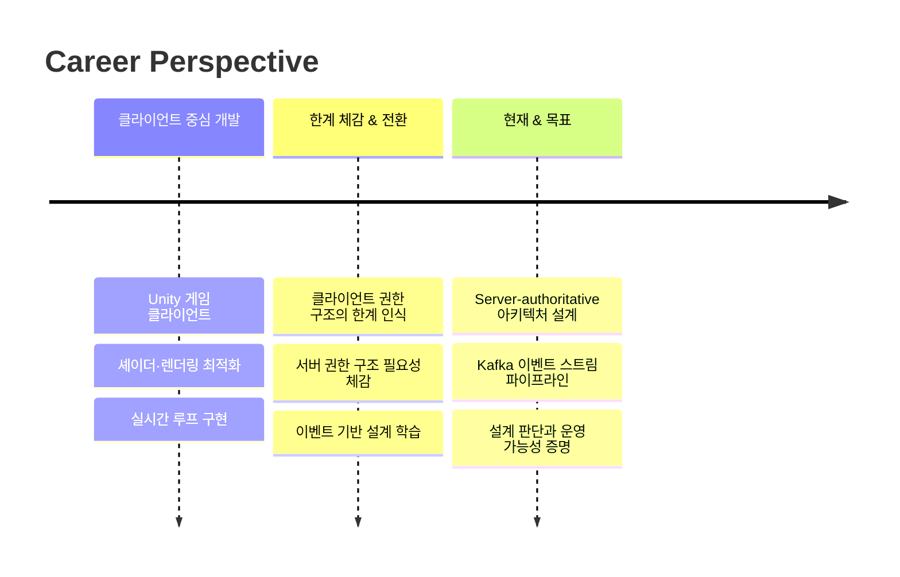
```mermaid
timeline
    title Career Perspective
    클라이언트 중심 개발 : Unity 게임 클라이언트
                        : 셰이더·렌더링 최적화
                        : 실시간 루프 구현
    한계 체감 & 전환 : 클라이언트 권한 구조의 한계 인식
                    : 서버 권한 구조 필요성 체감
                    : 이벤트 기반 설계 학습
    현재 & 목표 : Server-authoritative 아키텍처 설계
              : Kafka 이벤트 스트림 파이프라인
              : 설계 판단과 운영 가능성 증명
```

-----

## 🚩 Main Portfolio — 상세

**Event-driven Real-time Game Platform**  
→ [portpolio_main](https://github.com/1985jwlee/portpolio_main)

> 실시간 판정은 메모리에서 즉시 끝나고, 기록과 복구는 비동기로 흡수되는 구조.  
> 코드 구현이 아닌 **"어떤 판단으로 이 구조에 도달했는가"**를 증명하는 포트폴리오입니다.

---

### 전체 시스템 구조

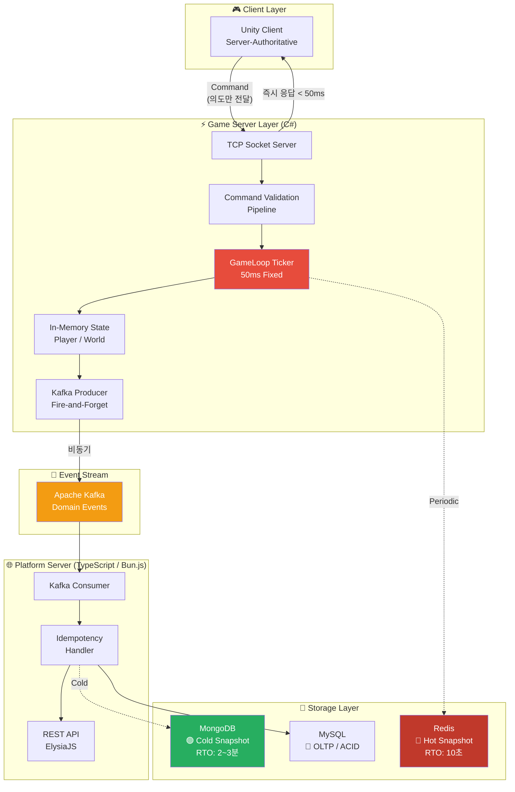
```mermaid
graph TB
    subgraph Client["🎮 Client Layer"]
        UNITY["Unity Client\nServer-Authoritative"]
    end

    subgraph GameServer["⚡ Game Server Layer (C#)"]
        GS["TCP Socket Server"]
        GAMELOOP["GameLoop Ticker\n50ms Fixed"]
        MEMORY["In-Memory State\nPlayer / World"]
        CMD["Command Validation\nPipeline"]
        EPB["Kafka Producer\nFire-and-Forget"]
    end

    subgraph EventStream["📨 Event Stream"]
        KAFKA["Apache Kafka\nDomain Events"]
    end

    subgraph Platform["🌐 Platform Server (TypeScript / Bun.js)"]
        CONSUMER["Kafka Consumer"]
        HANDLER["Idempotency\nHandler"]
        API["REST API\nElysiaJS"]
    end

    subgraph Storage["💾 Storage Layer"]
        REDIS["Redis\n🔴 Hot Snapshot\nRTO: 10초"]
        MONGO["MongoDB\n🟢 Cold Snapshot\nRTO: 2~3분"]
        MYSQL["MySQL\n🔵 OLTP / ACID"]
    end

    UNITY -->|"Command\n(의도만 전달)"| GS
    GS --> CMD --> GAMELOOP --> MEMORY --> EPB
    EPB -->|"비동기"| KAFKA
    KAFKA --> CONSUMER --> HANDLER --> API
    GAMELOOP -.->|"Periodic"| REDIS
    HANDLER -.->|"Cold"| MONGO
    HANDLER --> MYSQL
    GS -->|"즉시 응답 < 50ms"| UNITY

    style GAMELOOP fill:#e74c3c,color:#fff
    style KAFKA fill:#f39c12,color:#fff
    style REDIS fill:#c0392b,color:#fff
    style MONGO fill:#27ae60,color:#fff
```

---

### 5대 설계 원칙

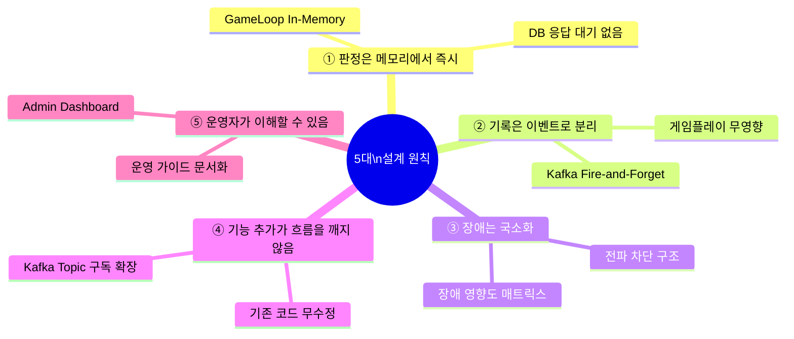
```mermaid
mindmap
  root((5대\n설계 원칙))
    ① 판정은 메모리에서 즉시
      GameLoop In-Memory
      DB 응답 대기 없음
    ② 기록은 이벤트로 분리
      Kafka Fire-and-Forget
      게임플레이 무영향
    ③ 장애는 국소화
      장애 영향도 매트릭스
      전파 차단 구조
    ④ 기능 추가가 흐름을 깨지 않음
      Kafka Topic 구독 확장
      기존 코드 무수정
    ⑤ 운영자가 이해할 수 있음
      Admin Dashboard
      운영 가이드 문서화
```

---

### 핵심 흐름: Command → Event

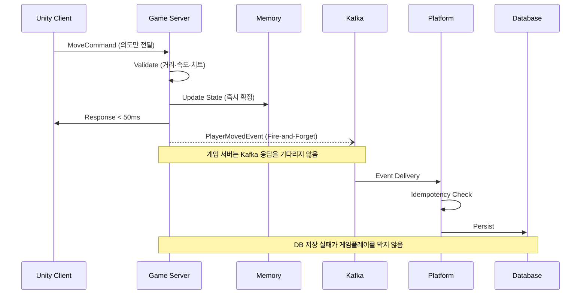
```mermaid
sequenceDiagram
    participant C as Unity Client
    participant GS as Game Server
    participant M as Memory
    participant K as Kafka
    participant PS as Platform
    participant DB as Database

    C->>GS: MoveCommand (의도만 전달)
    GS->>GS: Validate (거리·속도·치트)
    GS->>M: Update State (즉시 확정)
    GS->>C: Response < 50ms
    GS--)K: PlayerMovedEvent (Fire-and-Forget)
    Note over GS,K: 게임 서버는 Kafka 응답을 기다리지 않음
    K->>PS: Event Delivery
    PS->>PS: Idempotency Check
    PS->>DB: Persist
    Note over GS,DB: DB 저장 실패가 게임플레이를 막지 않음
```

---

### 장애 영향도 매트릭스

| 장애 대상 | 게임플레이 | 기록 | 운영 API | RTO | 복구 방식 |
|-----------|------------|------|----------|-----|----------|
| 게임 서버 | 🔴 중단 | 🟡 일시 중단 | 🟢 정상 | 10초 | Redis Hot Snapshot |
| Redis | 🟡 순간 지연 | 🟢 정상 | 🟢 정상 | 수초 | Failover |
| Kafka | 🟢 정상 | 🟡 일시 중단 | 🟢 정상 | 즉시 | 메모리 버퍼 |
| MySQL | 🟢 정상 | 🟡 일시 중단 | 🔴 일부 실패 | 중간 | Kafka 누적 재처리 |
| 플랫폼 서버 | 🟢 정상 | 🟡 일시 중단 | 🔴 중단 | 수초 | 재시작 + Offset 재개 |

> **설계 철학**: "게임플레이는 어떤 백엔드 장애에도 멈추지 않는다"

---

### 의도적으로 하지 않은 것들

| 비선택 | 이유 |
|--------|------|
| 게임 서버 직접 DB 접근 | GameLoop이 DB 응답 대기 → 장애 전파 |
| 초기 MSA 구조 | Over-engineering, 운영 복잡도 과다 |
| UDP 프로토콜 | 아키텍처 증명 목적에 불필요한 복잡도 |
| 완전한 MMO 콘텐츠 | "언제 멈추어야 하는지 안다"를 증명하기 위해 |

---

### Supporting Portfolios → Main 설계 기여 근거

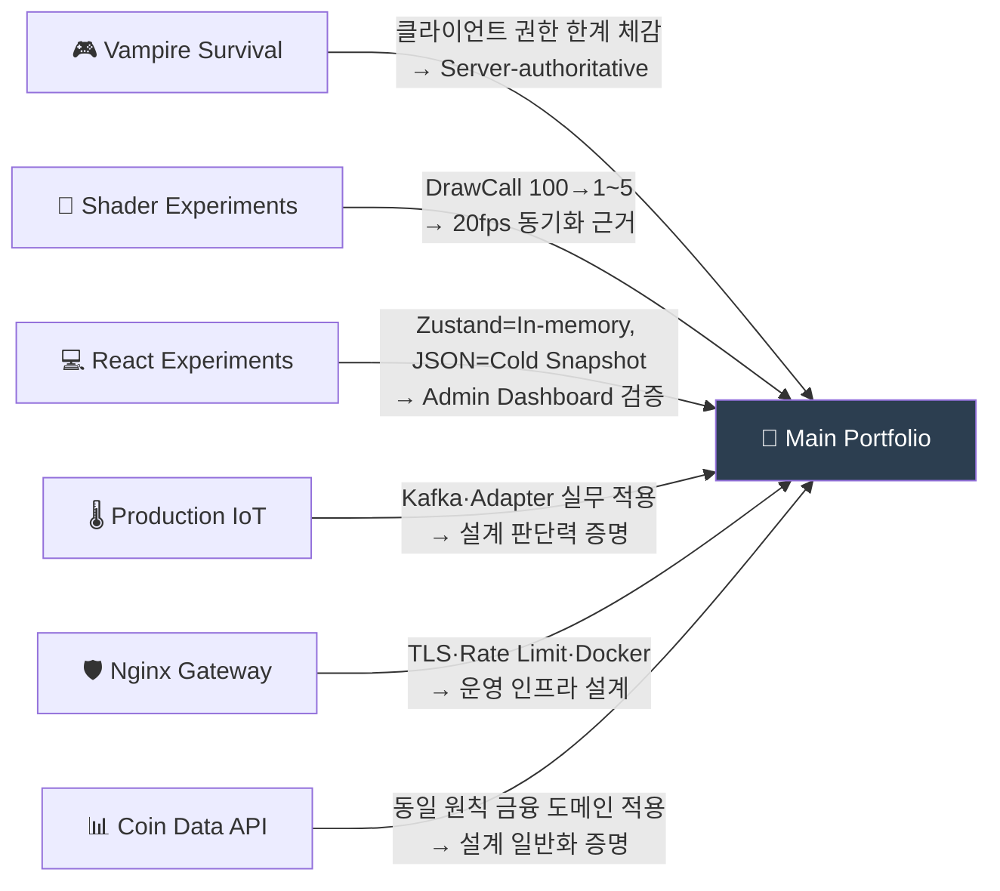
```mermaid
graph LR
    VAMPIRE["🎮 Vampire Survival"] -->|"클라이언트 권한 한계 체감\n→ Server-authoritative"| MAIN
    SHADER["🎨 Shader Experiments"] -->|"DrawCall 100→1~5\n→ 20fps 동기화 근거"| MAIN
    REACT["💻 React Experiments"] -->|"Zustand=In-memory, JSON=Cold Snapshot\n→ Admin Dashboard 검증"| MAIN
    IOT["🌡️ Production IoT"] -->|"Kafka·Adapter 실무 적용\n→ 설계 판단력 증명"| MAIN
    NGINX["🛡️ Nginx Gateway"] -->|"TLS·Rate Limit·Docker\n→ 운영 인프라 설계"| MAIN
    COIN["📊 Coin Data API"] -->|"동일 원칙 금융 도메인 적용\n→ 설계 일반화 증명"| MAIN

    MAIN["🚩 Main Portfolio"]

    style MAIN fill:#2c3e50,color:#fff
```

---

### 구현 로드맵

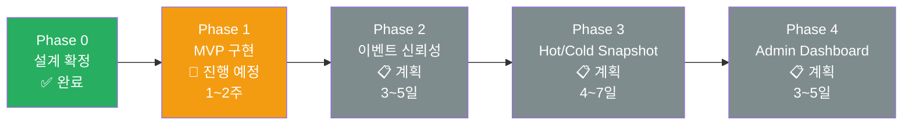
```mermaid
graph LR
    P0["Phase 0\n설계 확정\n✅ 완료"] --> P1["Phase 1\nMVP 구현\n🔄 진행 예정\n1~2주"]
    P1 --> P2["Phase 2\n이벤트 신뢰성\n📋 계획\n3~5일"]
    P2 --> P3["Phase 3\nHot/Cold Snapshot\n📋 계획\n4~7일"]
    P3 --> P4["Phase 4\nAdmin Dashboard\n📋 계획\n3~5일"]

    style P0 fill:#27ae60,color:#fff
    style P1 fill:#f39c12,color:#fff
    style P2 fill:#7f8c8d,color:#fff
    style P3 fill:#7f8c8d,color:#fff
    style P4 fill:#7f8c8d,color:#fff
```

| Phase | 핵심 완료 조건 |
|-------|---------------|
| Phase 1 | Client → Server → Kafka → Platform → DB 전체 흐름 동작 |
| Phase 2 | Idempotency + DLQ 동작 |
| Phase 3 | 서버 재시작 후 상태 복원 (Redis → MongoDB 순차) |
| Phase 4 | 실시간 모니터링 + Snapshot 관리 UI |

---

### 📐 기술 스택

| 영역 | 기술 |
|------|------|
| 게임 서버 | C# .NET 8.0, TCP/IP, MessagePack |
| 플랫폼 서버 | TypeScript, Bun.js, ElysiaJS, Drizzle ORM |
| 이벤트 스트림 | Apache Kafka |
| 저장소 | Redis · MongoDB · MySQL |
| 클라이언트 | Unity 2022.3 LTS |

---

### 📚 상세 문서

| 문서 | 내용 | 대상 |
|------|------|------|
| [아키텍처 상세](docs/architecture-detail.md) | 전체 시스템 구조 · 설계 원칙 | 백엔드 엔지니어 |
| [설계 결정 과정](docs/design-decisions.md) | 왜 이렇게 설계했는가 | 테크 리드, CTO |
| [운영 가이드](docs/operational-guide.md) | 장애 대응 · 모니터링 | DevOps, SRE |
| [구현 로드맵](docs/implementation-roadmap.md) ⭐ | 단계별 구현 계획 | 개발자, PM |
| [다이어그램](docs/diagrams.md) | Mermaid 다이어그램 전체 | 프레젠테이션용 |

-----

|포트폴리오                       |링크                                                                           |역할                                      |
|----------------------------|-----------------------------------------------------------------------------|----------------------------------------|
|🌡️ **Production IoT Backend**|[production-iot-backend](https://github.com/1985jwlee/production-iot-backend)|실무 IoT 시스템 · 마이크로서비스 · 보안 설계            |
|🛡️ Nginx | [nginx](https://github.com/1985jwlee/nginx_settings)| Gatewaynginx_settingsDocker 기반 Nginx 설계 · HTTPS/TLS · Rate Limiting · CCTV 동적 프록시    |
|🎨 Client Rendering          |[Shader Experiments](https://github.com/1985jwlee/portpolio_shader)          |GPU, 프레임 단위 사고 이해                       |
|🎮 Real-time Game            |[Vampire Survival](https://github.com/1985jwlee/portpolio_vampiresurvival)   |실시간 루프·상태 관리 경험                         |
|📊 **Coin Data API**         |[portpolio_coindataapi](https://github.com/1985jwlee/portpolio_coindataapi)  |DI 컨테이너 · 웹서버 프레임워크 직접 구현 · 외부 데이터 파이프라인|
|💻 Frontend Literacy         |[React Experiments](https://github.com/1985jwlee/portpolio_react)            |전체 시스템 흐름 이해                            |

-----

## 🌡️ Production IoT Backend — 상세

**쿨링로드 백엔드 시스템 (도로 살수 장비 원격 제어)**  
→ [production-iot-backend](https://github.com/1985jwlee/production-iot-backend)

> 실제 도로 위 PLC 장비를 제어하는 프로덕션 IoT 시스템.  
> **“설계 판단 + 코드 리뷰 기반 버그 10종 수정 + 5가지 기술 챌린지 해결”** 로 운영 신뢰성을 직접 증명합니다.

**Version**: 3.8.0 | **Status**: ✅ Production Ready | **코드**: ~10,000 lines

-----

### 전체 시스템 구조

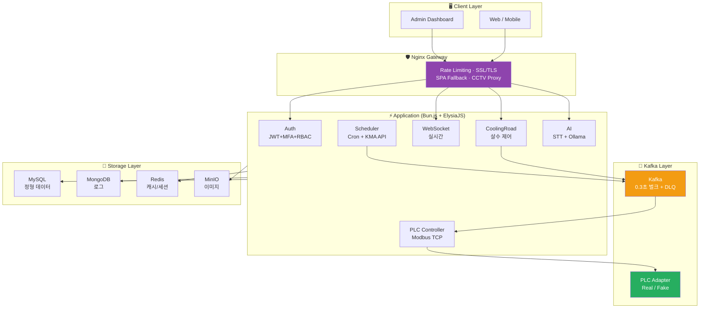
```mermaid
graph TB
    subgraph Client["🖥️ Client Layer"]
        WEB["Web / Mobile"]
        ADMIN["Admin Dashboard"]
    end

    subgraph Gateway["🛡️ Nginx Gateway"]
        RL["Rate Limiting · SSL/TLS\nSPA Fallback · CCTV Proxy"]
    end

    subgraph App["⚡ Application (Bun.js + ElysiaJS)"]
        AUTH["Auth\nJWT+MFA+RBAC"]
        COOLING["CoolingRoad\n살수 제어"]
        WS["WebSocket\n실시간"]
        PLC_C["PLC Controller\nModbus TCP"]
        SCHED["Scheduler\nCron + KMA API"]
        AI["AI\nSTT + Ollama"]
    end

    subgraph Infra["📨 Kafka Layer"]
        KAFKA["Kafka\n0.3초 벌크 + DLQ"]
        ADAPTER["PLC Adapter\nReal / Fake"]
    end

    subgraph Store["💾 Storage Layer"]
        MY["MySQL\n정형 데이터"]
        MG["MongoDB\n로그"]
        RD["Redis\n캐시/세션"]
        MN["MinIO\n이미지"]
    end

    WEB & ADMIN --> RL --> AUTH & COOLING & WS & AI
    COOLING & SCHED --> KAFKA --> PLC_C --> ADAPTER
    App --> MY & MG & RD & MN

    style KAFKA fill:#f39c12,color:#fff
    style ADAPTER fill:#27ae60,color:#fff
    style RL fill:#8e44ad,color:#fff
```

-----

### 3가지 핵심 설계 결정

**① PLC Adapter Pattern — 하드웨어 격리**

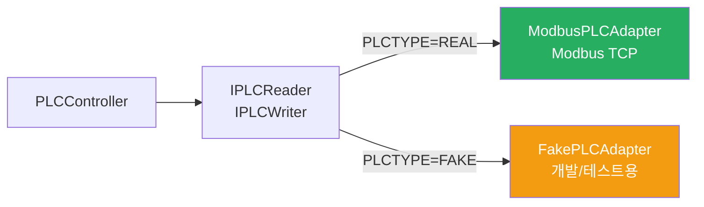
```mermaid
graph LR
    CTRL["PLCController"] --> IFACE["IPLCReader\nIPLCWriter"]
    IFACE -->|"PLCTYPE=REAL"| REAL["ModbusPLCAdapter\nModbus TCP"]
    IFACE -->|"PLCTYPE=FAKE"| FAKE["FakePLCAdapter\n개발/테스트용"]

    style REAL fill:#27ae60,color:#fff
    style FAKE fill:#f39c12,color:#fff
```

PLC 하드웨어 의존성을 인터페이스 뒤에 격리 → 개발 환경에서 실제 장비 없이 전환 가능.  
게임 서버의 Domain Event 격리, Coin Data API의 `IExchangeKlineManager`와 **동일한 원칙의 다른 도메인 적용**.

-----

**② Kafka 벌크 전송 + DLQ — 처리량과 신뢰성**

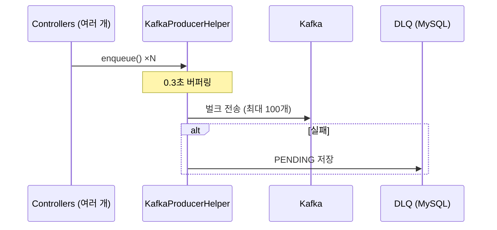
```mermaid
sequenceDiagram
    participant C as Controllers (여러 개)
    participant B as KafkaProducerHelper
    participant K as Kafka
    participant DLQ as DLQ (MySQL)

    C->>B: enqueue() ×N
    Note over B: 0.3초 버퍼링
    B->>K: 벌크 전송 (최대 100개)
    alt 실패
        B->>DLQ: PENDING 저장
    end
```

|지표     |즉시 전송    |벌크 전송       |
|-------|---------|------------|
|네트워크 요청|메시지당 1회  |100개당 1~2회  |
|처리량    |100 msg/s|5,000+ msg/s|
|CPU    |~80%     |~30%        |

-----

**③ JWT 이중 무효화 — PLC 제어 보안**

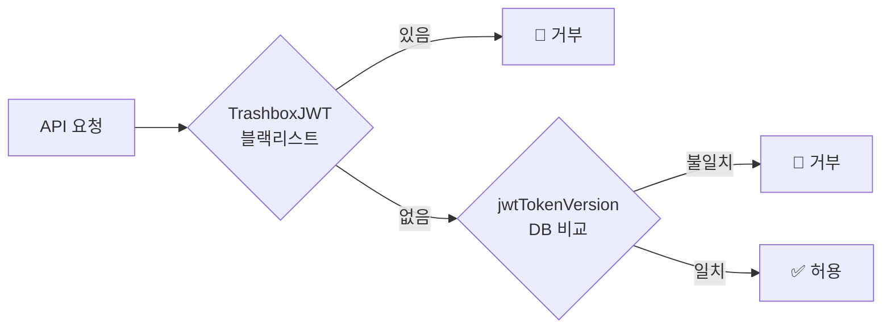
```mermaid
flowchart LR
    REQ["API 요청"] --> B1{"TrashboxJWT\n블랙리스트"}
    B1 -->|"있음"| D1["🔴 거부"]
    B1 -->|"없음"| B2{"jwtTokenVersion\nDB 비교"}
    B2 -->|"불일치"| D2["🔴 거부"]
    B2 -->|"일치"| OK["✅ 허용"]
```

로그아웃 즉시 무효화(TrashboxJWT) + 타기기 세션 자동 만료(jwtTokenVersion).  
PLC 제어처럼 민감한 작업에서의 동시 접근을 **구조로 방지**.

-----

### 의도적으로 하지 않은 것들

|비선택              |이유                                |
|-----------------|----------------------------------|
|Offset 페이지네이션    |1M rows에서 83배 성능 차이 → Cursor 선택   |
|백엔드 Rate Limiting|도달 후 차단 → 낭비. Nginx에서 도달 전 차단     |
|단일 JWT 무효화       |PLC 제어에서 로그아웃 후 재사용 = 보안 위협       |
|즉시 Kafka 전송      |고부하 네트워크 폭증 → 0.3초 버퍼링 선택         |
|MSA 즉시 분리        |규모 대비 운영 복잡도 과다 → Modular Monolith|

-----

### 코드 리뷰 기반 버그 수정 이력

> **“설계가 코드 리뷰 전까지는 안전해 보였다”**

|심각도       |버그                                      |수정 버전 |
|----------|----------------------------------------|------|
|🔴 Critical|RBAC `checkRole()` `async` 버그 → 모든 권한 우회|v3.5.0|
|🔴 Critical|Organizer 평문 비밀번호 SQL 비교 → bcrypt 전환    |v3.6.7|
|🔴 Critical|날씨 캐시 Redis hit 시 서버 크래시                |v3.6.0|
|🔴 Critical|PLC 멱등성 쿼리 방향 반전 → 중복 분사                |v3.6.0|
|🟠 High    |siteid 소유권 미검증 → 타기관 데이터 열람             |v3.6.0|
|🟠 High    |`stopSpray` 조건 `&&` → `||` 오류           |v3.6.0|

**구조적 개선**:

- AuthGuard 중복 ~70줄 → `createGuard()` 통합 (v3.3.18)
- FFmpeg 2단계 → 1단계 인코딩 (메모리 40%↓, 속도 30%↑) (v3.5.2)
- Offset → Cursor 페이징 (83배 성능) (v3.3.7)

-----

### 기술 챌린지 해결 과정

실무 운영 중 마주한 5가지 기술적 문제와 해결 요약.

|챌린지              |문제                                           |해결                                                         |
|-----------------|---------------------------------------------|-----------------------------------------------------------|
|WebSocket 안정성    |모바일 네트워크 전환 시 좀비 연결 누적 + 즉시 재연결 폭증           |Application-level Heartbeat (30s/90s) + Exponential Backoff|
|이미지 처리 병목        |10개 현장 동시 캡처 → FFmpeg 10개 동시 실행 → OOM 크래시    |`Semaphore(3)` 직접 구현 + FFmpeg WebP 직접 출력 (Sharp 제거)        |
|실시간 동기화          |HTTP Polling — 데이터 변경 없어도 N개 클라이언트가 매 5초 요청  |Kafka + WebSocket Push, 사이트 소유 그룹 기반 라우팅                   |
|다중 환경 설정         |환경변수 하드코딩 분산 → 배포 후 런타임에서야 오류 발견             |`configs.ts` 단일 진입점 + 시작 시점 필수값 검증                         |
|Graceful Shutdown|DB 먼저 종료 → Kafka 버퍼 메시지 DLQ 저장 실패 + 타이머 순서 오류|Kafka 버퍼 비우기 → `clearInterval` → Kafka 종료 → DB 종료          |

상세 내용 → [TECHNICAL_CHALLENGES.md](docs/TECHNICAL_CHALLENGES.md)

-----

### Polyglot Persistence

|저장소    |역할                        |선택 이유            |
|-------|--------------------------|-----------------|
|MySQL  |사용자·사이트·이력·PLC 명령         |ACID, 복잡한 JOIN   |
|MongoDB|API 로그·MFA 로그·에러·PLC 이벤트  |유연한 스키마, 대용량     |
|Redis  |JWT 세션·기상 캐시·분사 중인 사이트 Set|속도, TTL, Set 자료구조|
|MinIO  |CCTV 이미지·유지보수 사진          |S3 호환, 오브젝트 스토리지 |

-----

### 주요 기능 목록

- 🔐 **인증**: JWT HS512 + MFA TOTP + RBAC 4계층
- 🌡️ **살수 제어**: PLC Modbus TCP + 멱등성 체크 + 자동 분사 (Cron)
- 🌐 **실시간**: WebSocket + Kafka 연동, 11가지 토픽
- 📊 **모니터링**: MongoDB 중앙화 로그 + Admin API
- 🎙️ **음성 명령**: STT Kafka → Ollama LLM 분석 → WebSocket 결과
- 🔧 **유지보수**: 이력 등록 + MinIO 이미지 + 실시간 알림
- 🛡️ **Nginx**: Rate Limiting + SSL/TLS + CCTV 프록시 + SPA Fallback

-----

### 기술 스택

|영역                 |기술                                    |
|-------------------|--------------------------------------|
|Runtime / Framework|Bun.js + ElysiaJS + TypeScript        |
|ORM / DI           |Drizzle ORM + tsyringe                |
|Message Queue      |Apache Kafka (KafkaJS)                |
|PLC 통신             |Modbus TCP (modbus-serial)            |
|이미지 처리             |FFmpeg (WebP 직접 인코딩)                  |
|저장소                |MySQL · MongoDB · Redis · MinIO       |
|인프라                |Docker Compose · Nginx · Let’s Encrypt|

-----

### 📚 상세 문서

|문서                                              |내용                  |대상        |
|------------------------------------------------|--------------------|----------|
|[설계 결정 과정](docs/design-decisions-portfolio.md) ⭐|왜 이렇게 설계했는가         |테크 리드, CTO|
|[기술 챌린지](docs/TECHNICAL_CHALLENGES.md) ⭐        |문제 → 원인 → 해결 과정     |테크 리드, CTO|
|[아키텍처](docs/ARCHITECTURE.md)                    |전체 시스템 구조           |백엔드 엔지니어  |
|[배포 가이드](docs/DEPLOYMENT.md)                    |Docker + Nginx + SSL|DevOps    |
|[API 계약](docs/API_CONTRACT.md)                  |API 그룹 구성 + 에러 코드 체계|프론트엔드 개발자 |
|[WebSocket 가이드](docs/WEBSOCKET_GUIDE.md)        |WebSocket 통합        |프론트엔드 개발자 |
|[코드 개선 이력](CHANGELOG.md)                        |리팩터링 흐름 (테마별)       |백엔드 엔지니어  |

    
-----

### 📊 Coin Data API 상세

**설계 원칙의 도메인 일반화 증명 — DI 컨테이너 · 웹서버 프레임워크 직접 구현 · 외부 데이터 파이프라인**

> 메인 포트폴리오의 설계 원칙이 게임 외 도메인에서도 동일하게 작동함을 증명한 프로젝트입니다.  
> 단순히 라이브러리를 "사용"하는 것을 넘어, 프레임워크가 **왜 그렇게 설계되었는지**를 직접 구현으로 증명했습니다.

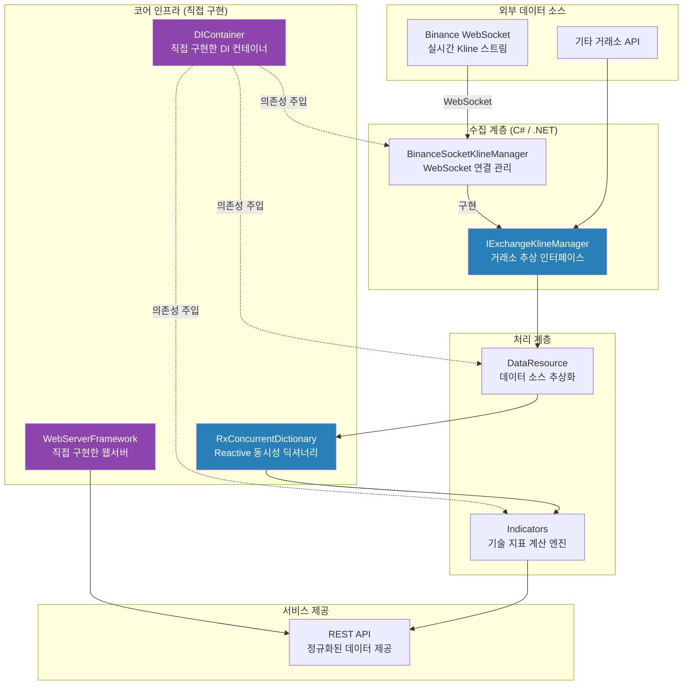
```mermaid
graph TB
    subgraph External["외부 데이터 소스"]
        BINANCE["Binance WebSocket\n실시간 Kline 스트림"]
        OTHER["기타 거래소 API"]
    end

    subgraph Ingestion["수집 계층 (C# / .NET)"]
        SOCKET["BinanceSocketKlineManager\nWebSocket 연결 관리"]
        IEXCHANGE["IExchangeKlineManager\n거래소 추상 인터페이스"]
        SOCKET -->|구현| IEXCHANGE
    end

    subgraph Core["코어 인프라 (직접 구현)"]
        DI["DIContainer\n직접 구현한 DI 컨테이너"]
        WEB["WebServerFramework\n직접 구현한 웹서버"]
        RX["RxConcurrentDictionary\nReactive 동시성 딕셔너리"]
    end

    subgraph Processing["처리 계층"]
        DR["DataResource\n데이터 소스 추상화"]
        IND["Indicators\n기술 지표 계산 엔진"]
    end

    subgraph Output["서비스 제공"]
        API["REST API\n정규화된 데이터 제공"]
    end

    BINANCE -->|WebSocket| SOCKET
    OTHER --> IEXCHANGE
    IEXCHANGE --> DR
    DI -.->|의존성 주입| SOCKET
    DI -.->|의존성 주입| DR
    DI -.->|의존성 주입| IND
    DR --> RX
    RX --> IND
    IND --> API
    WEB --> API

    style DI fill:#8e44ad,color:#fff
    style WEB fill:#8e44ad,color:#fff
    style IEXCHANGE fill:#2980b9,color:#fff
    style RX fill:#2980b9,color:#fff
```

**직접 구현한 것들과 그 이유:**

| 직접 구현한 것 | 이유 | 얻은 것 |
|-------------|------|--------|
| DI 컨테이너 | 프레임워크 내부 동작 이해 | 의존성 그래프 · 생명주기 완전 제어 |
| 웹서버 프레임워크 | HTTP 파이프라인 원리 체득 | 미들웨어 · 라우팅 구조 깊은 이해 |
| `IExchangeKlineManager` 인터페이스 | 거래소 교체 가능성 전제 | 데이터 소스 변경 시 서비스 무영향 |
| `RxConcurrentDictionary` | 동시성 + 반응형 데이터 필요 | 스레드 안전 + 변경 스트림 구독 |

**장애 격리 설계:**

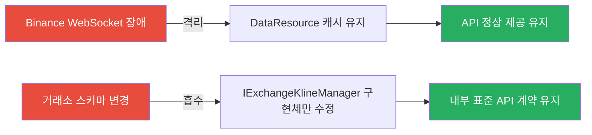
```mermaid
flowchart LR
    A["Binance WebSocket 장애"] -->|격리| B["DataResource 캐시 유지"]
    B --> C["API 정상 제공 유지"]
    D["거래소 스키마 변경"] -->|흡수| E["IExchangeKlineManager 구현체만 수정"]
    E --> F["내부 표준 API 계약 유지"]

    style A fill:#e74c3c,color:#fff
    style D fill:#e74c3c,color:#fff
    style C fill:#27ae60,color:#fff
    style F fill:#27ae60,color:#fff
```

**메인 포트폴리오 설계 원칙 — 도메인 일반화 대응표:**

| 원칙 | 메인 포트폴리오 (게임) | Coin Data API (금융) |
|------|---------------------|-------------------|
| **외부 격리** | DB 장애 시 게임플레이 계속 | 거래소 장애 시 캐시 API 제공 |
| **정규화 계층** | Domain Event → DB Schema | External API → Internal Schema |
| **계약 안정성** | 운영 API 불변 유지 | 클라이언트 API 불변 유지 |
| **비동기 처리** | Kafka Event Stream | WebSocket → Queue → Cache |
| **장애 복구** | Redis Hot / MongoDB Cold Snapshot | In-Memory Cache + 자동 재연결 |

> **핵심 메시지**: "설계 원칙은 게임 도메인에만 국한되지 않습니다.  
> 같은 원칙이 금융 도메인에서도 동일하게 작동함을 직접 구현으로 증명합니다."

-----

### 🛡️ Nginx Gateway 상세

**IoT 현장 제어 시스템의 인프라 게이트웨이 레이어**

> Production IoT Backend의 단일 진입점 역할을 담당하는 Nginx 설계 문서입니다.  
> 설정 파일 코드보다 **왜 이렇게 설계했는가**에 집중한 인프라 포트폴리오입니다.
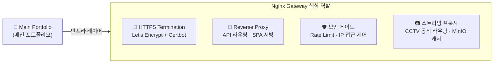
```mermaid
flowchart LR
    subgraph INFRA["Nginx Gateway 핵심 역할"]
        TLS["🔐 HTTPS Termination\nLet's Encrypt + Certbot"]
        PROXY["🔀 Reverse Proxy\nAPI 라우팅 · SPA 서빙"]
        SEC["🛡️ 보안 게이트\nRate Limit · IP 접근 제어"]
        MEDIA["📷 스트리밍 프록시\nCCTV 동적 라우팅 · MinIO 캐시"]
    end

    MAIN["🚩 Main Portfolio\n(메인 포트폴리오)"] -->|인프라 레이어| INFRA
```

| 설계 포인트 | 판단 근거 |
|---|---|
| Nginx를 단일 Gateway로 | 포트 단일화 · TLS 분리 · Rate Limiting 중앙화 |
| Compose 스택 분리 | 배포 주기가 다른 서비스는 독립적으로 운영 |
| Webroot 방식 인증서 갱신 | Nginx 중단 없이 12시간 주기 자동 갱신 |
| CCTV 동적 프록시 | 카메라 자격증명을 Nginx 레이어에서 주입, 프론트엔드 노출 방지 |

-----

### 🎨 Shader Experiments 상세

**GPU 프레임 예산 직접 측정 — 커스텀 라이팅 · Dissolve · 아웃라인 직접 구현**

> 단순히 셰이더를 사용한 것이 아니라, 렌더링 비용을 수치로 측정하고 최적화한 경험입니다.
> 이 과정에서 얻은 클라이언트 부하 이해가 메인 포트폴리오의 서버 설계 판단으로 이어졌습니다.

| 구현 내용 | 핵심 수치 / 결과 | 메인 포트폴리오로 이어진 인사이트 |
|----------|---------------|-------------------------------|
| CustomLight.hlsl 직접 구현 | Unity 기본 라이팅 우회 → 프레임 비용 측정 가능 | 클라이언트 렌더링 비용을 블랙박스가 아닌 수치로 이해 |
| GPU Instancing 도입 | Draw Call 100개 → 1~5개 | 서버 동기화 빈도 20fps 제한의 설계 근거 |
| LOD 3단계 구성 | 근거리 LOD 300 / 원거리 Unlit | 프레임 예산 = 고정 자원, 집중과 절감의 배분 |
| Dissolve 마스크 6종 조합 | 최대 24개 동시 적용 | 확장 시 기존 코드 수정 없는 조합 구조 |

-----

### 🎮 Vampire Survival 상세

**클라이언트 중심 설계의 한계 직접 체험 — Server-authoritative 설계 판단의 출발점**

> 이 프로젝트에서 잘 설계된 구조도 **멀티플레이어 확장 시도 순간** 근본적 한계를 드러냈습니다.  
> 이 경험이 메인 포트폴리오에서 "상태 권한은 서버에만 존재해야 한다"는 설계 판단의 직접적 근거가 되었습니다.

| Vampire Survival에서 체감한 문제 | 메인 포트폴리오의 해법 | 이어진 설계 판단 |
|-------------------------------|---------------------|--------------|
| 클라이언트 간 상태 불일치 — 어느 쪽이 진실인지 판정 불가 | 서버 단독 상태 관리 | 상태 권한은 서버에만 존재한다 |
| 클라이언트 메모리 조작으로 치트 방어 구조적 불가능 | Command Validation (서버 검증) | 클라이언트 입력은 신뢰하지 않는다 |
| 동기화 기준점 부재 — 확장할수록 불일치 누적 | Server-authoritative + 단일 GameLoop | 서버 상태가 유일한 진실(Single Source of Truth) |
| 멀티플레이어 확장 시 전체 구조 교체 필요 | Zone 기반 수평 확장 설계 | 확장을 전제로 초기 구조를 설계한다 |

-----

### 💻 React Experiments 상세

**메인 포트폴리오 Admin Dashboard의 선행 기술 검증 프로토타입**

> 서버에서 설계한 상태 관리·스냅샷·이벤트 개념을 "실제로 UI로 구현할 수 있는가"를 먼저 검증한 프로젝트입니다.  
> 메인 포트폴리오의 핵심 개념을 React + Zustand로 동작하는 형태로 옮겨 증명했습니다.
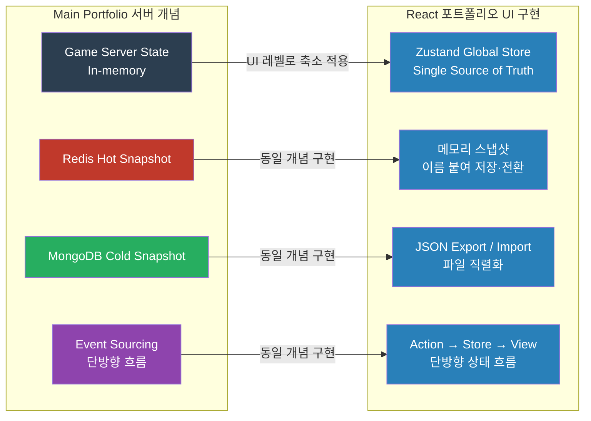
```mermaid
graph LR
    subgraph Server["Main Portfolio 서버 개념"]
        S1[Game Server State<br/>In-memory]
        S2[Redis Hot Snapshot]
        S3[MongoDB Cold Snapshot]
        S4[Event Sourcing<br/>단방향 흐름]
    end

    subgraph UI["React 포트폴리오 UI 구현"]
        U1[Zustand Global Store<br/>Single Source of Truth]
        U2[메모리 스냅샷<br/>이름 붙여 저장·전환]
        U3[JSON Export / Import<br/>파일 직렬화]
        U4[Action → Store → View<br/>단방향 상태 흐름]
    end

    S1 -->|UI 레벨로 축소 적용| U1
    S2 -->|동일 개념 구현| U2
    S3 -->|동일 개념 구현| U3
    S4 -->|동일 개념 구현| U4

    style S1 fill:#2c3e50,color:#fff
    style S2 fill:#c0392b,color:#fff
    style S3 fill:#27ae60,color:#fff
    style S4 fill:#8e44ad,color:#fff
    style U1 fill:#2980b9,color:#fff
    style U2 fill:#2980b9,color:#fff
    style U3 fill:#2980b9,color:#fff
    style U4 fill:#2980b9,color:#fff
```

| Main Portfolio 설계 | React Portfolio 검증 |
|--------------------|---------------------|
| Game Server State (In-memory) | Zustand Single Source of Truth |
| Redis Hot Snapshot | 메모리 스냅샷 저장·전환 |
| MongoDB Cold Snapshot | JSON Export / Import |
| Event Sourcing | Action → Store → View 단방향 흐름 |
| Admin Dashboard 설계 | Inspector / Editor / Preview 패턴 구현 |

-----

## 💡 Core Competencies

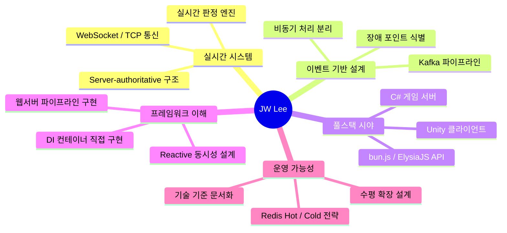
```mermaid
mindmap
  root((JW Lee))
    실시간 시스템
      Server-authoritative 구조
      WebSocket / TCP 통신
      실시간 판정 엔진
    이벤트 기반 설계
      Kafka 파이프라인
      비동기 처리 분리
      장애 포인트 식별
    풀스택 시야
      Unity 클라이언트
      C# 게임 서버
      bun.js / ElysiaJS API
    프레임워크 이해
      DI 컨테이너 직접 구현
      웹서버 파이프라인 구현
      Reactive 동시성 설계
    운영 가능성
      수평 확장 설계
      Redis Hot / Cold 전략
      기술 기준 문서화
```

-----

## 🔗 Tech Stack

**🎮 Game Client**  

**⚙️ Game Server / Backend**  

**🌐 Platform API**  

**🌡️ IoT / Protocol**  

**📨 Event Stream & Messaging**  

**💾 Database & Cache**  

**💻 Frontend**  

**🔐 Security**  

**🛠️ Tools & Infra**  

-----

## 📬 Contact

각 저장소는 독립적 결과물이면서 **하나의 설계 철학으로 연결**됩니다.  
단순 기술 나열이 아닌, **설계 판단의 축적**을 확인하고 싶다면 메인 포트폴리오를 먼저 보세요.

**→ [portpolio_main](https://github.com/1985jwlee/portpolio_main)**
